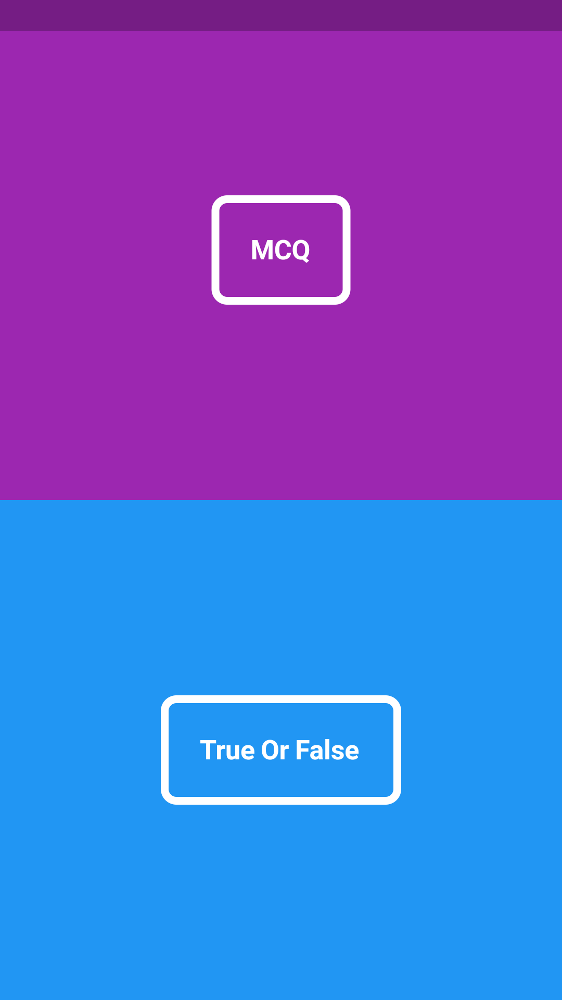

 # Ganesh Tiwari

Hey there this is my personal website..

I am a programming enthusiast I am currently working on mobile development frameworks but I wish to work on machine  learning and other artificial intelligence related subjects too.

Here is a list of applications that I have built so far..

1) Quiz App

This app was made as a college project in Flutter using dart language and was my first ever cross platform application ever. And I should also inform you that I just love dart.

2) Nationalite Nss App

NSS or National Service Scheme is a Government Scheme under which young students work to help society  as well as hone their extra curricular skills so that they can lead a better life as well as learn some knowledge about society. I worked with NSS during my college years for 2 consecutive years I was head of Street Play team of our college and I loved Working their. I made this app out of my love for this organization so that they'll be able to perform better in this growing digital world.

3) Fitness App

This app is currently under development and I am making this app so as to help one of my best friends. I will be posting Screenshots of the app as soon as I develop them.

Thanks for visiting